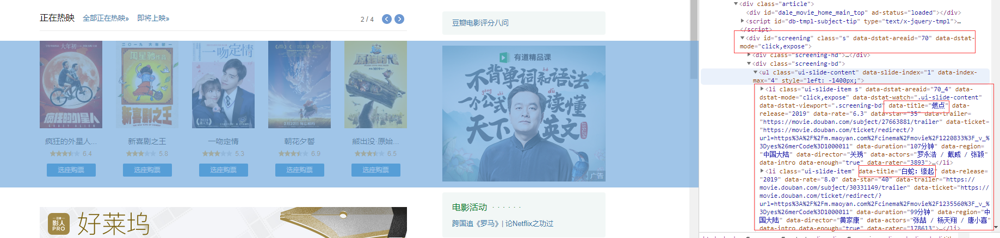
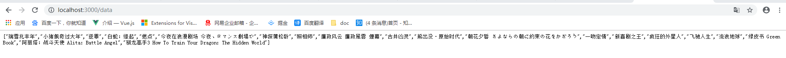
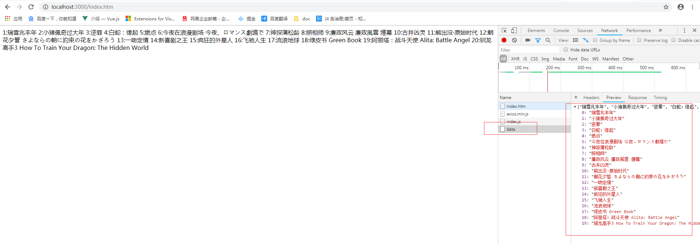

# 前言
node和Python一样适合做爬虫爬取数据进行解析输出相应格式的json数据。
这个项目爬虫的基本原理在，获取到页面的HTML内容，使用[cheerio](https://www.javascriptcn.com/read-50700.html)去解析HTML，操作DOM节点获取数据。


# 技术栈
node+express+axois

# 项目运行
```
git clone https://github.com/fancyzhe/nodeGetData.git
npm install
npm start
```
在项目的`package.json`文件中定义了script`"start": "nodemon app.js"`,用`nodemon`护node进程，所以是项目中直接运行的`app.js`


# 具体解析

## 引入项目所需要的模块

> express作为服务器
> cheerio将获取到的HTML内容解析成DOM节点
> request请求接口数据
> path定义静态文件访问路径

```
const express = require("express");
const cheerio = require("cheerio");
const request =  require("request");
const path = require('path')

const app = express();
//定义要抓取数据的页面地址URL
const url = "https://movie.douban.com/";
```


## 定义抓取页面HTML内容并解析的方法getData
> request请求异步，所以方法返回promise，在.then中去获取到request的数据。

```
function getData(){
    let data =[];
    return new Promise((resolve,reject)=>{
        request(url,(err,res,body)=>{
        	//body是页面的HTML内容，使用cheerio去解析它。
            $ = cheerio.load(body);
            //定义了$对象后，可以类似jQuery的用法去选择DOM节点
            let content = $("#screening .ui-slide-item");
            let length = content.length;
            //获取的DOM节点对象数组进行循环，输出我们想要的json对象
            while(length--){
                let title = $(content[length]).attr("data-title");
                title && data.push(title);
            }
            resolve(data)
        })
    })
}
```
**以在审查元素中看到电影的名字在`#screening .ui-slide-item`节点的`data-title`属性中，所以在上面的代码中用取节点的方式去取出我们想要的数据**


## 定义接口/data

> 这里相当于是在后端定义了/data接口，本地访问localhost:3000/data就可以访问到send回来的数组data。

```
app.get("/data",(req,res)=>{
    console.log("getData")
    getData().then(data=>{
        res.send(data)
    })
});
```



## 定义express静态文件访问路径

[参考地址](http://www.expressjs.com.cn/starter/static-files.html)

>定义了静态文件后，可以在直接访问index.htm去请求接口，再根据数据去改变view。也可以将数据包装成自己想要的样子去render出自己的页面。

`app.use(express.static(path.join(__dirname, 'public')))`



## express进行端口监听

`app.listen(3000,()=>console.log("run 3000"))`


# 最后

项目比较简单，没有用webpack起项目，只用简单的静态去映射出爬取的数据。这是一个node爬虫入门的小demo，了解爬虫的基本原理。


[项目地址](https://github.com/fancyzhe/nodeGetData)
